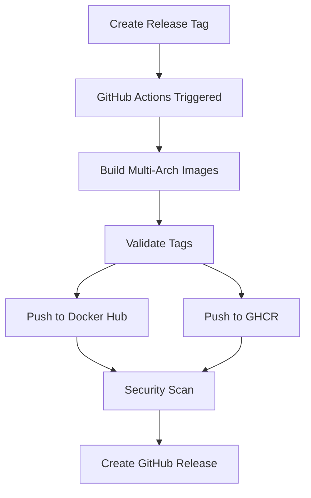
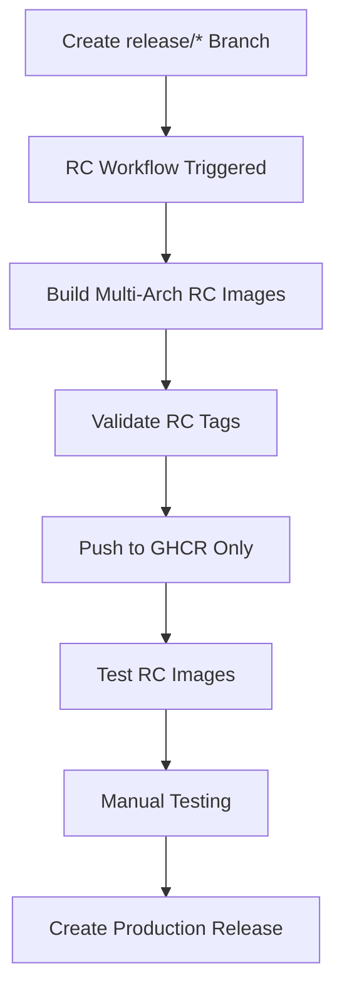

# 🚀 Workflow Improvements

This document summarizes the improvements made to our GitHub Actions workflows based on analysis of the [magicalyak/nzbgetvpn](https://github.com/magicalyak/nzbgetvpn) repository.

## 📊 Comparison Summary

| Feature | nzbgetvpn | transmissionvpn | Status |
|---------|-----------|-----------------|--------|
| **Clean Tag Strategy** | ✅ Version tags only | ✅ Version tags only | ✅ Implemented |
| **Tag Validation** | ✅ Comprehensive | ✅ Comprehensive | ✅ Implemented |
| **Debug Output** | ✅ Detailed | ✅ Detailed | ✅ Implemented |
| **Error Handling** | ✅ Robust | ✅ Robust | ✅ Implemented |
| **Release Notes** | ✅ Automated | ✅ Automated | ✅ Implemented |
| **Release Script** | ✅ Full automation | ✅ Full automation | ✅ Implemented |
| **RC Workflow** | ✅ Docker Hub + GHCR | ✅ GHCR only | ✅ Implemented |
| **Versioning** | Standard semver | Custom rXX format | ✅ Kept custom |

## 🎯 Key Improvements Implemented

### 1. Enhanced Tag Validation
- **Before**: Basic tag generation without validation
- **After**: Comprehensive validation checking for empty tags and invalid characters
- **Benefit**: Prevents deployment failures from malformed tags

```yaml
- name: Validate generated tags
  run: |
    echo "🔍 Validating generated tags for invalid references..."
    TAGS='${{ steps.meta.outputs.tags }}'
    
    # Check for empty tags
    if [[ -z "$TAGS" ]]; then
      echo "❌ ERROR: No tags generated!"
      exit 1
    fi
    
    # Validate each tag format
    IFS=',' read -ra TAG_ARRAY <<< "$TAGS"
    for tag in "${TAG_ARRAY[@]}"; do
      tag_name=$(echo "$tag" | sed 's/.*://')
      if [[ ! "$tag_name" =~ ^[a-zA-Z0-9._-]+$ ]]; then
        echo "❌ ERROR: Invalid tag format: $tag_name"
        exit 1
      fi
      echo "✅ Valid tag: $tag"
    done
```

### 2. Better Debug Output
- **Before**: Limited visibility into tag generation
- **After**: Comprehensive debug information showing all generated tags and metadata
- **Benefit**: Easier troubleshooting and workflow monitoring

```yaml
- name: Debug metadata output
  run: |
    echo "🔍 Debug Information:"
    echo "Event name: ${{ github.event_name }}"
    echo "Ref: ${{ github.ref }}"
    echo "Version: ${{ steps.meta.outputs.version }}"
    echo "Generated tags:"
    echo '${{ steps.meta.outputs.tags }}' | tr ',' '\n' | sed 's/^/  - /'
```

### 3. Robust Error Handling
- **Before**: Basic manifest creation
- **After**: JSON validation and graceful error handling
- **Benefit**: More reliable builds with clear error messages

```yaml
- name: Create manifest list and push to Docker Hub
  run: |
    # Validate JSON output exists
    if [[ -z "$DOCKER_METADATA_OUTPUT_JSON" ]]; then
      echo "❌ ERROR: DOCKER_METADATA_OUTPUT_JSON is empty!"
      exit 1
    fi
    
    # Extract tags safely with validation
    DOCKERHUB_TAGS=$(echo "$DOCKER_METADATA_OUTPUT_JSON" | jq -cr '.tags | map(select(contains("docker.io")) | "-t " + .) | join(" ")')
    
    if [[ -z "$DOCKERHUB_TAGS" || "$DOCKERHUB_TAGS" == "null" ]]; then
      echo "❌ ERROR: No Docker Hub tags found!"
      exit 1
    fi
```

### 4. Automated Release Notes
- **Before**: Manual release notes
- **After**: Automated categorized release notes with Docker image links
- **Benefit**: Consistent, professional releases with less manual work

```yaml
# .github/release-drafter.yml
categories:
  - title: '🚀 Features'
    labels: ['feature', 'feat', 'enhancement']
  - title: '🐛 Bug Fixes'
    labels: ['bug', 'fix', 'bugfix']
  - title: '📊 Monitoring & Metrics'
    labels: ['monitoring', 'metrics', 'prometheus', 'grafana']
```

### 5. Release Candidate Workflow
- **Before**: No pre-release testing capability
- **After**: RC workflow that pushes to GHCR only (not Docker Hub)
- **Benefit**: Test releases before production deployment

```bash
# Create RC branch to trigger testing
git checkout -b release/v4.0.6-r15
git push origin release/v4.0.6-r15

# RC images available at:
# ghcr.io/magicalyak/transmissionvpn:rc-latest
# ghcr.io/magicalyak/transmissionvpn:release-v4.0.6-r15-rc
```

### 6. Streamlined Release Process
- **Before**: Manual tag creation and pushing
- **After**: Automated release script with validation and guidance
- **Benefit**: Consistent release process with fewer errors

```bash
# Simple release process
./scripts/release.sh
# Script handles: validation, tagging, pushing, and monitoring
```

## 🔄 Workflow Architecture

### Production Release Flow


### Release Candidate Flow


## 📋 Decision Matrix

| Decision Point | nzbgetvpn Approach | Our Decision | Rationale |
|----------------|-------------------|--------------|-----------|
| **Tag Validation** | Comprehensive validation | ✅ Adopt | Prevents deployment failures |
| **Debug Output** | Detailed logging | ✅ Adopt | Better troubleshooting |
| **Error Handling** | Robust with fallbacks | ✅ Adopt | More reliable builds |
| **Release Notes** | Automated with categories | ✅ Adopt | Saves time, ensures consistency |
| **RC Workflow** | Docker Hub + GHCR | 🔄 GHCR only | Keep production Docker Hub clean |
| **Versioning** | Standard semver (v25.0.30) | 🔄 Keep custom (v4.0.6-r14) | Our format works well for incremental releases |
| **Release Script** | Full automation | ✅ Adopt | Streamlines release process |

## 🎉 Results

### Before Improvements
- ❌ 71 total Docker Hub tags (58 unwanted)
- ❌ Limited error handling
- ❌ Manual release process
- ❌ No pre-release testing

### After Improvements
- ✅ Clean Docker Hub tags (only releases)
- ✅ Comprehensive validation and error handling
- ✅ Automated release process with script
- ✅ RC workflow for pre-release testing
- ✅ Professional automated release notes
- ✅ Better debugging and monitoring

## 🚀 Usage

### Standard Release
```bash
# Update version in scripts/release.sh
./scripts/release.sh
# Follow prompts to create and push release tag
```

### Release Candidate Testing
```bash
# Create RC branch
git checkout -b release/v4.0.6-r15
git push origin release/v4.0.6-r15

# Test RC image
docker pull ghcr.io/magicalyak/transmissionvpn:rc-latest
```

### Monitor Builds
- **GitHub Actions**: https://github.com/magicalyak/transmissionvpn/actions
- **Docker Hub**: https://hub.docker.com/r/magicalyak/transmissionvpn/tags
- **GHCR**: https://github.com/magicalyak/transmissionvpn/pkgs/container/transmissionvpn

## 📚 References

- **nzbgetvpn Repository**: https://github.com/magicalyak/nzbgetvpn
- **Docker Metadata Action**: https://github.com/docker/metadata-action
- **Release Drafter**: https://github.com/release-drafter/release-drafter
- **Docker Buildx**: https://docs.docker.com/buildx/ 